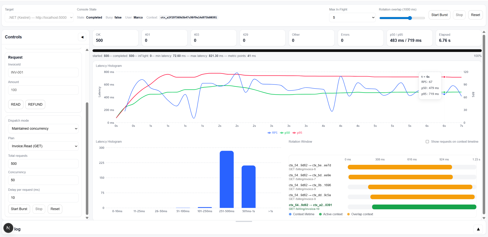
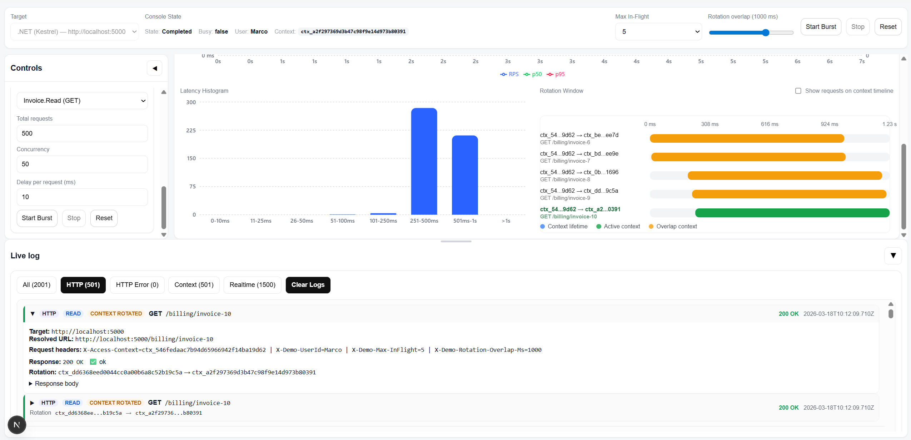
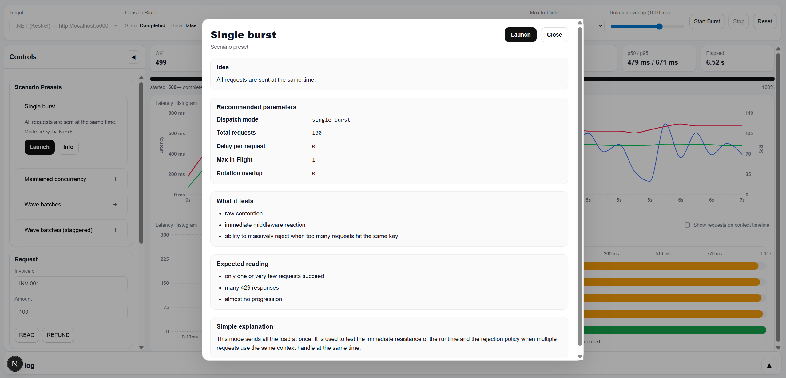
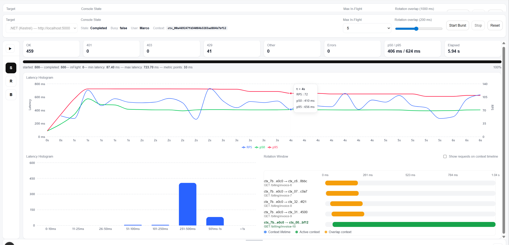
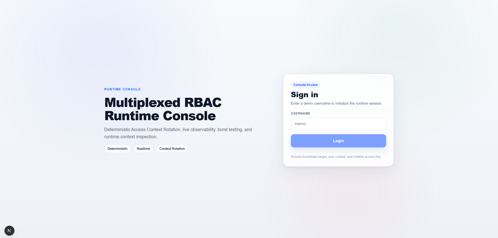

# Next.js Security & Runtime Observability Client

> Real-time demo client for the security, authorization-context, concurrency, and observability foundations that preceded and still connect to the **Deterministic AI Runtime**.

This client is not the AI Runtime itself.

It is the interactive **security and observability demo** originally built around Multiplexed RBAC to visualize:

- deterministic authorization decisions;
- distributed access-context rotation;
- concurrent in-flight request protection;
- HTTP / API request behavior;
- real-time runtime events;
- burst and wave scenarios;
- context-key lifecycle;
- authorization behavior under contention.

The broader repository has since evolved into the **Deterministic AI Runtime**: a durable, multi-tenant execution platform for DAG orchestration, policy-driven behavior, recovery, replay, lifecycle observation, Ledger, Forensics, Runtime Pools, Kubernetes, HTTP/gRPC execution, and durable Child DAGs.

This UI remains useful because it shows where part of that architecture began: **security context + real-time telemetry + deterministic behavior under concurrency**.

---

## Why This Client Exists

The original goal was broader than rendering an RBAC dashboard.

The first architecture explored the following pipeline:

```text
HTTP / API traffic
        ↓
Execution / Access Context
        ↓
Authorization Policy
        ↓
Context Rotation
        ↓
Real-Time Events
        ↓
Runtime Visualization
        ↓
AI-Assisted Analysis / Scenario Generation
```

The UI was created to make the runtime behavior visible while requests were executing.

The AI-assisted analysis and scenario-generation idea later exposed a deeper requirement:

> Generating a scenario is only useful if the system can execute it reliably, recover it after infrastructure failure, and prove what happened.

That requirement became one of the foundations of the current **Deterministic AI Runtime**.

---

# What the UI Demonstrates Today

## 1. Access Context

The sample uses a distributed authorization context identified by a rotating access-context key.

The key is sent using:

```http
X-Access-Context: <context-key>
```

The client always reuses the latest context key returned by the backend.

Depending on runtime configuration, the key may rotate after a successful request.

---

## 2. Deterministic TRN Authorization

Authorization is based on **Tenant Resource Names (TRN)**.

Example:

```text
trn:tev:crm:billing:invoice:read
```

TRNs provide a deterministic resource/capability format for:

- namespace isolation;
- tenant-aware authorization;
- capability evaluation;
- wildcard/resource matching;
- service-to-service authorization.

Conceptually:

```text
Request
   ↓
Execution Context
   ↓
Namespace Guard
   ↓
TRN Authorization Engine
   ↓
ALLOW / DENY
```

---

## 3. Distributed Context Rotation

Authorization context is stored in Redis and context-key rotation is coordinated atomically through Lua.

```text
Context Key A
      ↓
Request
      ↓
Authorization
      ↓
Atomic Rotation
      ↓
Context Key B
```

The client receives the new key and uses it for subsequent requests.

This mechanism was designed to exercise:

- stale-context handling;
- replay resistance;
- safe rotation;
- distributed state;
- race conditions;
- overlapping requests;
- bounded context-key reuse.

---

## 4. In-Flight Concurrency Protection

The demo can intentionally create concurrent requests against the same authorization context.

```text
Request 1 ─┐
Request 2 ─┼── same Access Context
Request 3 ─┘
             ↓
      In-Flight Protection
             ↓
       Allow / Reject
```

Runtime configuration supports bounded concurrent usage and rejection when the configured limit is exceeded.

This makes it possible to observe authorization behavior under real contention rather than only through sequential requests.

---

## 5. Real-Time Observability

Runtime events are streamed to the UI using SignalR.

The original observability architecture deliberately keeps event processing outside the HTTP request hot path:

```text
HTTP Request
    │
    ├──────────────► Application / Authorization
    │
    └──► Non-Blocking Event Channel
                 ↓
          Background Worker
                 ↓
              Reducers
                 ↓
              SignalR
                 ↓
           Next.js Client
```

Typical events include:

- request lifecycle;
- authorization decisions;
- context rotation;
- in-flight acquisition/release;
- concurrency violations;
- scenario activity;
- runtime diagnostics.

---

# UI Capabilities

The current client is intended as an engineering/demo surface rather than a production end-user application.

It can be used to:

- log in against the sample API;
- receive and retain the access-context key;
- send individual requests;
- launch concurrent bursts;
- execute repeatable scenarios;
- visualize context rotation;
- inspect in-flight request behavior;
- observe authorization results;
- watch real-time runtime logs/events.

---

## Advanced Demo Controls

### Max In-Flight

Controls how many requests may concurrently use the same access context.

Useful for demonstrating:

- bounded concurrency;
- overflow/rejection behavior;
- contention;
- stale-context scenarios.

---

### Rotation Overlap Window

Controls the overlap period during which rotation behavior can be exercised.

Useful for testing:

- concurrent key transitions;
- old/new key overlap;
- race conditions;
- propagation behavior.

These controls exist for testing and demonstration. They should not be treated as recommended production client-controlled security settings.

---

### Scenario Launcher

The UI can run predefined traffic patterns such as:

- single burst;
- maintained concurrency;
- wave-based batches.

These scenarios make concurrency behavior reproducible and easier to visualize.

---

# Screenshots

### Context Rotation



### Real-Time Logs



### Scenario Execution



### Concurrency Behavior



### Login / Initial Context



---

# Relationship to the Current Deterministic AI Runtime

The repository has evolved significantly beyond the original RBAC demo.

The current runtime provides a much broader execution substrate, including:

```text
Client / API / MCP
        ↓
RBAC ExecutionContext
        ↓
Durable Execution Context
        ↓
Tenant-Aware Admission
        ↓
Provider / Runtime Selection
        ↓
Local / Process / HTTP / gRPC / Kubernetes
        ↓
Deterministic DAG Engine
        ↓
Redis + Lua Coordination
        ↓
Durable State / MongoDB
        ↓
Canonical Lifecycle Events
        ↓
Ledger / Forensics / Journal / Metrics / Realtime
        ↓
Recovery / Replay / Audit
```

This Next.js client therefore represents an earlier but still relevant part of the architecture:

```text
SECURITY + REAL-TIME OBSERVABILITY
              │
              ▼
      Deterministic Runtime
```

The two are related, but they have different responsibilities.

---

# Architectural Evolution

## Original Demo

```text
HTTP / API
    ↓
Access Context
    ↓
RBAC / TRN
    ↓
Rotation
    ↓
Live Events
    ↓
UI
```

## Current Runtime

```text
Input / Work
    ↓
Policy-Driven Execution
    ↓
Deterministic DAG / Child DAG
    ↓
Durable State
    ↓
Runtime Pools / Process / Kubernetes
    ↓
Recovery
    ↓
Lifecycle Observation
    ↓
Ledger / Forensics / Replay
```

## Natural Extension

The same pattern can accept other telemetry sources through adapters without coupling the execution runtime to one provider:

```text
HTTP / Graph / APIs / Cloud / Other Sources
                    ↓
             Source Adapters
                    ↓
             Canonical Events
                    ↓
        Analysis / Policy Evaluation
                    ↓
         Deterministic Execution
                    ↓
          Evidence / Action / Verify
```

The important architectural boundary is:

> **sources observe the world; policies decide; the runtime owns execution semantics.**

---

# Technology

Current client dependencies include:

- Next.js 16
- React 19
- TypeScript
- SignalR
- Axios
- React Flow
- Recharts
- TanStack React Virtual

---

# Quick Start

## Prerequisites

For the Next.js client:

- Node.js compatible with the current Next.js version;
- npm.

For the full RBAC/security demo:

- the .NET sample API;
- Redis;
- any additional infrastructure required by the specific backend scenario.

RabbitMQ / NServiceBus are only needed for the legacy asynchronous service-to-service messaging scenario, not for simply starting the Next.js client.

---

## 1. Start Redis

Ensure the Redis instance expected by the .NET sample configuration is reachable.

The RBAC demo uses Redis for:

- distributed authorization context storage;
- atomic Lua-based rotation;
- in-flight request tracking.

---

## 2. Start the .NET Security Sample API

The historical RBAC demo uses the sample API:

```text
MultiplexedRbac.Sample.Crm.Api
```

Start the corresponding project from the .NET solution using your normal IDE profile or `dotnet run` for that project.

The demo login endpoint is:

```text
/demo/login
```

It creates the initial execution/access context and returns the first context key.

The client then sends that key on subsequent requests through:

```http
X-Access-Context
```

---

## 3. Start the Next.js Client

From the repository root:

```bash
cd clients/nextjs
npm install
npm run dev
```

Then open:

```text
http://localhost:3000
```

If dependencies are already installed:

```bash
cd clients/nextjs
npm run dev
```

---

## Production Build

```bash
cd clients/nextjs
npm install
npm run build
npm run start
```

---

## Lint

```bash
npm run lint
```

---

# Typical Demo Flow

A useful manual demo sequence is:

```text
1. Start Redis
2. Start the .NET sample API
3. Start the Next.js client
4. Login from the UI
5. Receive the initial X-Access-Context key
6. Send one authorized request
7. Observe the context key rotate
8. Increase concurrency / launch a burst
9. Observe in-flight requests and rejection behavior
10. Watch rotation and authorization events in real time
```

---

# What to Observe During a Demo

## Normal Request

```text
Request
   ↓
Context Resolved
   ↓
Capability Evaluated
   ↓
ALLOW
   ↓
Context Rotated
   ↓
New Key Returned
```

## Concurrent Requests

```text
                  ┌── Request A
Context Key ──────┼── Request B
                  └── Request C
                        ↓
                In-Flight Coordination
                        ↓
               Atomic Rotation / Limits
                        ↓
                 Deterministic Outcome
```

The purpose is not simply to show a successful HTTP request.

The purpose is to make normally invisible distributed-security behavior **observable**.

---

# Important Scope Note

This UI does **not** claim to be:

- a production SIEM;
- a CSPM/RSPM product;
- a cloud-provider scanner;
- an eBPF/runtime-memory collector;
- a regulatory compliance engine;
- the full Deterministic AI Runtime control plane.

It is a demo and engineering client for security-context, concurrency, scenario, and real-time observability behavior.

Its architectural value is that it demonstrates the pattern that preceded the larger runtime:

> **observe real execution → apply deterministic context/policy → expose lifecycle behavior → use the resulting evidence to reason about scenarios and execution.**

---

# Repository

Main project:

```text
https://github.com/mmarano2k14/deterministic-ai-runtime
```

Main repository documentation should be used for the current Deterministic AI Runtime architecture, recovery model, Runtime Pools, Kubernetes execution, durable Child DAGs, replay, Ledger, Forensics, lifecycle observation, and validation evidence.

---

# License

MIT
